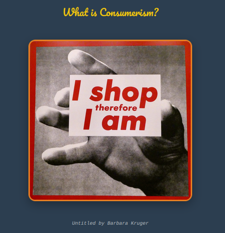

# On Consumerism

A site exploring how consumer culture shapes our lives, featuring theory, practical impacts, and ways to think critically about it all.

## What's here

**Main site** (`index.html`) - Walks through consumerism basics, key thinkers like Marx and Weber, how it plays out today (social media, gig economy, environmental costs), and some alternative approaches.

**Quiz** (`quiz.html`) - 10 scenarios testing critical thinking about consumer culture and economic systems. Questions range from workplace alienation to platform capitalism.

**Book recommendations** (`books.html`) - Curated reading list organized by themes like surveillance capitalism, debt, and alternative economics.

## Running it

Just open `index.html` in a browser or use the GitHub Pages Link.

The quiz saves results to localStorage and includes sharing functionality. Book recommendations link to OpenLibrary for more details.

## Files

- `index.html` - Main content site
- `quiz.html` + `quiz.js` - Interactive quiz
- `books.html` + `books.js` - Book recommendations with search
- `styles.css` - Styling for all pages
- `media/` - Images and favicon
